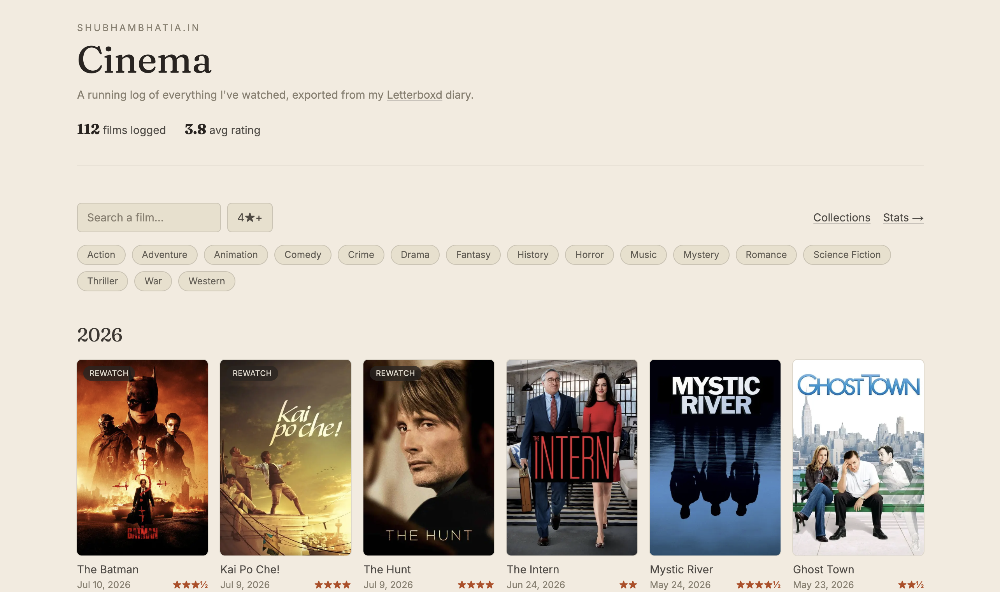
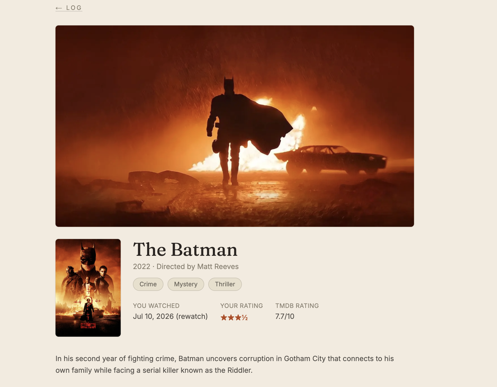
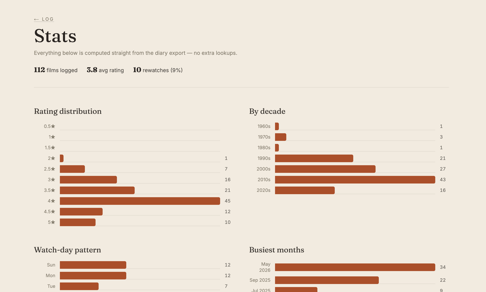
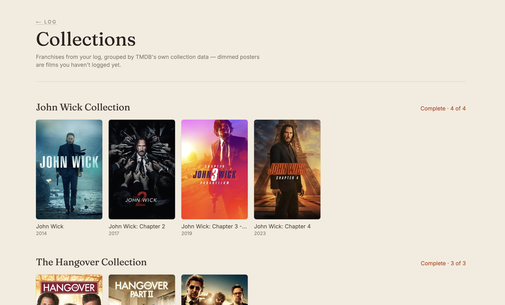

<div align="center">

# Cinema

**A personal film log, rebuilt from a Letterboxd diary export.**

[](https://cinema.shubhambhatia.in)
[](https://nextjs.org)
[](https://www.typescriptlang.org)
[](https://www.themoviedb.org)
[](https://vercel.com)

Part of a small series of projects on [shubhambhatia.in](https://shubhambhatia.in), alongside
[tracker.shubhambhatia.in](https://tracker.shubhambhatia.in) (open-source habit tracker).

</div>

<br>



<br>

## What it does

No database, no live scraping — the site reads a CSV file (a Letterboxd diary export) at
build time and turns it into a real film log, enriched with posters, cast, and trailers from
TMDB.

|  |  |
|---|---|
| **📖 The log** | Every film you've watched, grouped by year, with a live search and a 4★+ filter |
| **🎬 Film pages** | Backdrop, poster, synopsis, cast, trailer, your rating vs. TMDB's, and your own review if you wrote one |
| **🍿 Similar films** | 4 recommendations per film from TMDB, regardless of whether you've seen them — anything you have is marked "Watched" |
| **🎭 Genre chips** | Filter the whole log by genre, pulled straight from TMDB |
| **📊 Stats** | Rating distribution, decade breakdown, watch-day pattern, busiest months, rewatch rate, highs and lows — all computed from your own diary, no extra lookups |
| **🧩 Collections** | Franchises grouped automatically (e.g. all 4 John Wicks as one entry), with a "3 of 4 watched" progress count |

<table>
<tr>
<td width="50%"></td>
<td width="50%"></td>
</tr>
<tr>
<td align="center"><sub>Film detail page</sub></td>
<td align="center"><sub>Stats page</sub></td>
</tr>
</table>



<p align="center"><sub>Collections page</sub></p>

## How it works

<details>
<summary><strong>Data model</strong></summary>

<br>

There's no database. `data/diary.csv` (a Letterboxd diary export) is read at build time and
enriched with TMDB data — posters, genres, director, cast, trailer, and recommendations —
which Next.js caches for 30 days via its own data cache. Everything is statically generated:
the log, every film's own page (`/film/[slug]`), stats, and collections are all prerendered
at build time, so there's no runtime API cost per visitor.

</details>

<details>
<summary><strong>Updating your log</strong></summary>

<br>

This is meant to be repeated every time you want the site to catch up to your real
Letterboxd diary — there's no live sync, so re-exporting is the update mechanism.

1. On Letterboxd: **Settings → Data → Export Your Data**. This downloads a zip.
2. Unzip it and drop the whole folder into `data/` — no need to dig out individual files.
   `lib/letterboxd.ts` searches `data/` for a file named `diary.csv` (and `reviews.csv`) and
   uses whatever it finds.
3. Commit to a branch and open a PR into `main` (see workflow note below). Once merged,
   Vercel rebuilds from the new file automatically.

Letterboxd's export is always your *whole* diary, not just what changed since last time, so
the new `diary.csv` fully replaces the old one — new entries, edited ratings, and rewatches
all just show up correctly with no merge step.

**Workflow:** changes land on `main` via pull request, not direct pushes — including data
updates. Branch off `main`, commit the new `diary.csv`, open a PR, merge when it looks right.

**Privacy:** only `diary.csv` and `reviews.csv` are ever read, and they're the only files
from an export that `.gitignore` lets into the repo — the rest (`watchlist.csv`,
`comments.csv`, `likes/`, `ratings.csv`, `watched.csv`, ...) stays on your machine, untracked,
since that's more "private activity" than "movies I've watched." If you'd rather commit the
whole export as-is, adjust the `data/**` rules in `.gitignore`.

The expected columns (Letterboxd's own diary export format) are:

```
Date,Name,Year,Letterboxd URI,Rating,Rewatch,Tags,Watched Date
```

`data/diary.csv` currently has a handful of sample entries so the site runs out of the box —
swap it for your real export whenever you're ready.

</details>

<details>
<summary><strong>TMDB setup (optional)</strong></summary>

<br>

Copy `.env.example` to `.env.local` and add a free
[TMDB](https://www.themoviedb.org/settings/api) API key as `TMDB_API_KEY` — use the **API
Key** (v3 auth), not the Read Access Token. Without it, cards fall back to a clean text-only
design (title + year) and the enrichment features (posters, genres, cast, trailers, similar
films, collections) simply don't render, so this is entirely optional to get the site
running.

</details>

<details>
<summary><strong>Development</strong></summary>

<br>

```bash
npm install
npm run dev
```

```bash
npm run build   # full production build, statically generates every film page
npm run start   # serve the production build locally
```

</details>

<details>
<summary><strong>Deploying</strong></summary>

<br>

Any Next.js host works (Vercel is the obvious pick to match the other subdomains). Point
`cinema.shubhambhatia.in` at the deployment and set `TMDB_API_KEY` there too if you're using
it — Production and Preview environments are configured separately in Vercel, so add it to
both if you want PR previews to show real posters.

</details>

## Roadmap

Built out phase by phase — see [`ROADMAP.md`](ROADMAP.md) for what shipped, what's next, and
the reasoning behind each one.
